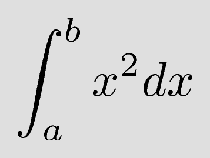

# discord-selfbot.py

This is my personal Discord self-bot. Feel free to host and use it yourself.

Currently it's only command is `>tex` which will take whatever comes after it and will compile it as a `latex` snippet.

For example, send the message `>tex $$\int_{a}^{b} x^2 dx$$` will trigger the selfbot to compile it and respond with:



## Usage

First, you must have the following commands available in your PATH:
- `pdflatex` 
- `convert` (part of ImageMagick)

Create a virtual environment with Python >= 3.5 and activate it:
```shell
$ virtualenv -p python3.5 venv
$ source venv/bin/activate
```

Install the dependencies:
```shell
$ pip install -r requirements.txt
```

Create a file called `config.json` at the root level with the field `token` containing your self token.

```json
{
  "json": "token here"
}
```

Then run the bot:
```shell
$ ./launch.sh
```


